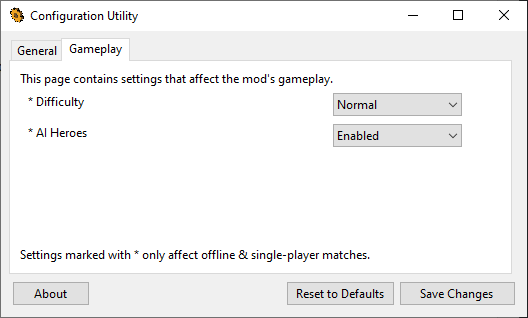
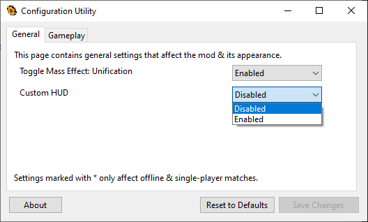

# Configuration Utility

This is a tool that enables Star Wars Battlefront II mod authors to allow players to configure their mods.

Mod authors can set up tabs and dropdown settings through a simple JSON file. When a player changes a setting, the settings are saved and munged into a single .SCRIPT file as a global Lua table. The settings are simple key(string)-value(number) pairs in the table.

## Examples

Consider the following JSON file:

	{
	  "fileVersion": 1,
	  "mungedScriptFileName": "modconfig",
	  "userConfigLuaTableName": "gModConfig",
	  "configTabs": [
		{
		  "name": "General",
		  "description": "This page contains general settings that affect the mod && its appearance.",
		  "footnote": "Settings marked with * only affect offline && single-player matches.",
		  "flags": [
			{
			  "path": "cfg_MEUnificationEnabled",
			  "name": "Toggle Mass Effect: Unification",
			  "toolTipCaption": "Whether or not the mod's missions should be added to the game.",
			  "values": [
				"Disabled",
				"Enabled"
			  ],
			  "defaultValue": 1
			},
			{
			  "path": "cfg_CustomHUD",
			  "name": "Custom HUD",
			  "values": [
				"Disabled",
				"Enabled"
			  ],
			  "defaultValue": 1
			}
		  ]
		},
		{
		  "name": "Gameplay",
		  "description": "This page contains settings that affect the mod's gameplay.",
		  "footnote": "Settings marked with * only affect offline && single-player matches.",
		  "flags": [
			{
			  "path": "cfg_Difficulty",
			  "name": "* Difficulty",
			  "values": [
				"Casual",
				"Normal",
				"Veteran",
				"Hardcore",
				"Insanity"
			  ],
			  "defaultValue": 1
			},
			{
			  "path": "cfg_AIHeroes",
			  "name": "* AI Heroes",
			  "values": [
				"Disabled",
				"Enabled"
			  ],
			  "defaultValue": 1
			}
		  ]
		}
	  ]
	}

This would generate the following tabs and dropdown settings:

 

When the player changes a setting value in the app, the value is saved as an integer based on the ordering of the settings in the dropdown, starting at 0.

Example of a Lua script that is generated and munged from a player's config (based on the previous JSON example):

    gModConfig = {
		cfg_MEUnificationEnabled = 1,	-- Enabled
		cfg_CustomHUD = 0,				-- Disabled
		cfg_Difficulty = 1,				-- Normal
		cfg_AIHeroes = 1,				-- Enabled
	}

This would then be munged into a file called `modconfig.script`, which can then be loaded into the game with `ScriptCB_DoFile`. The table's values could then be accessed by `gModConfig.cfg_MEUnificationEnabled` etc.

The file gets re-munged each time "Save Changes" is pressed.

## Remarks

It is recommended to use a unique Lua table name for mods that would load the munged script into a menu, since more than one script of the same name cannot be loaded into the game at once. The Lua table name can be set via the `userConfigLuaTableName` field in the JSON file.

A way to reasonably guarantee a unique table name would be to simply append the mod's ID to the name, e.g. `gMEUModConfig`.